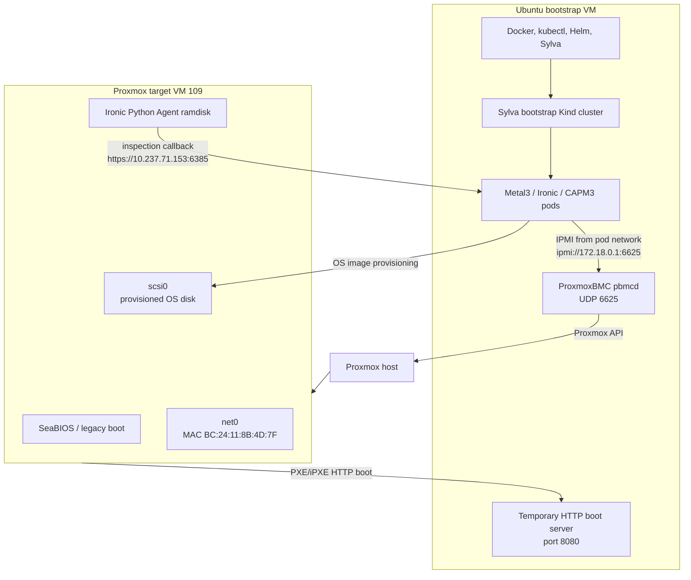

# Validated Sylva CAPM3 ProxmoxBMC Lab

This runbook is the cleaned-up version of the lab we debugged end to end. It documents the exact design that worked, every major problem we hit, how we proved the cause, and how to build the same Proxmox fake bare-metal Sylva lab with fewer surprises.

Use this guide when:

- You have Proxmox, not VMware.
- You cannot create a large nested virtualization lab.
- You want Sylva CAPM3/Metal3 behavior with one Proxmox VM treated like bare metal.
- You run ProxmoxBMC on the bootstrap VM to control another Proxmox VM.

## Final Validated Result

The lab reached this important Metal3 state:

```text
registering -> inspecting -> preparing -> available -> provisioning
```

That means:

- ProxmoxBMC power control worked.
- Metal3 registered the BareMetalHost.
- iPXE boot worked.
- Ironic Python Agent inspection succeeded.
- CAPM3 claimed the host.
- OS provisioning started.

## Validated Architecture



## Validated IP Plan

These values are from the working lab. Change them for a new environment, but keep the same logic.

| Purpose | Lab Value |
| --- | --- |
| Bare-metal/provisioning network | `10.237.71.0/24` |
| Gateway | `10.237.71.254` |
| Bootstrap VM IP | `10.237.71.153` |
| Kind bridge gateway from pods | `172.18.0.1` |
| Kind node IP | `172.18.0.2` |
| ProxmoxBMC IPMI port | `6625/udp` |
| Correct BMC address in Sylva | `ipmi://172.18.0.1:6625` |
| Target VM boot MAC | `BC:24:11:8B:4D:7F` |
| Example target node IP during PXE | `10.237.71.187` |
| Temporary HTTP boot server | `http://10.237.71.153:8080` |
| Ironic API | `https://10.237.71.153:6385/v1/` |
| Ironic HTTPS image server | `https://10.237.71.153:6185` |

Important: `10.237.71.153:6625` worked from the bootstrap VM shell, but not from Metal3 pods. Metal3 needed the pod-reachable Docker bridge address:

```text
ipmi://172.18.0.1:6625
```

## Clean Build Workflow


## Step 1: Create the Bootstrap VM

Create an Ubuntu 22.04 VM on Proxmox.

Recommended:

| Component | Value |
| --- | --- |
| CPU | 4+ vCPU |
| RAM | 8 to 16 GB |
| Disk | 50+ GB |
| Network | Same network as target VM |
| Example IP | `10.237.71.153` |

Install base packages:

```bash
sudo apt update
sudo apt install -y \
  curl \
  git \
  jq \
  make \
  python3 \
  python3-pip \
  python3-venv \
  ca-certificates \
  ipmitool \
  yamllint
```

Install Docker:

```bash
sudo apt remove docker docker-engine docker.io containerd runc -y
sudo mkdir -p /etc/apt/keyrings

curl -fsSL https://download.docker.com/linux/ubuntu/gpg | \
sudo gpg --dearmor -o /etc/apt/keyrings/docker.gpg

echo \
"deb [arch=$(dpkg --print-architecture) \
signed-by=/etc/apt/keyrings/docker.gpg] \
https://download.docker.com/linux/ubuntu \
$(lsb_release -cs) stable" | \
sudo tee /etc/apt/sources.list.d/docker.list > /dev/null

sudo apt update
sudo apt install -y docker-ce docker-ce-cli containerd.io
sudo systemctl enable docker
sudo systemctl start docker
sudo usermod -aG docker $USER
newgrp docker
```

Verify:

```bash
docker ps
hostname -I
```

## Step 2: Create the Proxmox Target VM

Create a second VM on Proxmox. This VM is the fake bare-metal host.

Validated target VM settings:

| Setting | Value |
| --- | --- |
| VMID | `109` |
| Name | `baremetal` or `fake-bm-01` |
| BIOS | SeaBIOS |
| Metal3 boot mode | `legacy` |
| NIC | `net0` |
| MAC | `BC:24:11:8B:4D:7F` |
| Disk | `scsi0` |
| Boot order | `net0`, then `scsi0` |
| Proxmox firewall | Disabled on VM and NIC |
| OS install | None; Metal3 installs the OS |

In Proxmox UI:

```text
VM 109 -> Hardware -> Network Device -> Edit
  Bridge: same lab bridge as bootstrap VM
  MAC: BC:24:11:8B:4D:7F
  Firewall: unchecked

VM 109 -> Options -> Boot Order
  1. net0
  2. scsi0

VM 109 -> Firewall -> Options
  Firewall: No
```

From a Proxmox host shell, the equivalent checks are:

```bash
qm config 109
```

Expected concepts:

```text
bios: seabios
boot: order=net0;scsi0
net0: virtio=BC:24:11:8B:4D:7F,bridge=<bridge>,firewall=0
scsi0: ...
```

## Step 3: Create a Proxmox API Token

In Proxmox UI:

```text
Datacenter -> Permissions -> API Tokens
```

Create a token for a user that can manage VM 109.

Required permissions:

- `VM.Audit`
- `VM.PowerMgmt`
- `VM.Config.Options`

Set these variables on the bootstrap VM:

```bash
export PVE_HOST="<proxmox-host-or-ip>"
export PVE_NODE="<proxmox-node-name>"
export PVE_TOKEN_USER="<user@realm>"
export PVE_TOKEN_NAME="<token-name>"
export PVE_TOKEN_ID="<user@realm!token-name>"
export PVE_TOKEN_SECRET="<token-secret>"
export TARGET_VMID="109"
```

Test the API:

```bash
curl -k \
  -H "Authorization: PVEAPIToken=${PVE_TOKEN_ID}=${PVE_TOKEN_SECRET}" \
  "https://${PVE_HOST}:8006/api2/json/nodes/${PVE_NODE}/qemu/${TARGET_VMID}/status/current" | jq
```

If this fails, ProxmoxBMC will not work.

## Step 4: Install and Start ProxmoxBMC

On the bootstrap VM:

```bash
cd ~
git clone https://github.com/agnon/proxmoxbmc.git
cd proxmoxbmc

python3 -m venv .env
. .env/bin/activate
pip install -r requirements.txt
pip install .
```

Start the daemon in one terminal:

```bash
cd ~/proxmoxbmc
. .env/bin/activate
pbmcd
```

In another terminal, add the target VM:

```bash
cd ~/proxmoxbmc
. .env/bin/activate

pbmc add \
  --username admin \
  --password password \
  --port 6625 \
  --address 0.0.0.0 \
  --proxmox-address "${PVE_HOST}" \
  --token-user "${PVE_TOKEN_USER}" \
  --token-name "${PVE_TOKEN_NAME}" \
  --token-value "${PVE_TOKEN_SECRET}" \
  "${TARGET_VMID}"

pbmc start "${TARGET_VMID}"
pbmc list
```

Expected:

```text
VMID  Status   Address  Port
109   running  0.0.0.0  6625
```

Optional systemd service:

```bash
sudo vim /etc/systemd/system/pbmcd.service
```

Example:

```ini
[Unit]
Description=pbmcd service
After=network.target

[Service]
ExecStart=/home/oie/proxmoxbmc/.env/bin/pbmcd --foreground
Restart=on-failure
RestartSec=2
TimeoutSec=120
Type=simple
User=oie
Group=oie

[Install]
WantedBy=multi-user.target
```

Enable it:

```bash
sudo systemctl daemon-reload
sudo systemctl enable pbmcd
sudo systemctl start pbmcd
sudo journalctl -u pbmcd -f
```

## Step 5: Validate BMC Access from Bootstrap and from Pod

From the bootstrap VM:

```bash
ipmitool -I lanplus -H 10.237.71.153 -p 6625 -U admin -P password power status
```

From a Kubernetes pod, after the Sylva bootstrap cluster exists:

```bash
kubectl run ipmi-test \
  -n sylva-system \
  --rm -it \
  --restart=Never \
  --image=ubuntu:22.04 \
  -- bash
```

Inside the pod:

```bash
apt update
apt install -y ipmitool iputils-ping netcat-openbsd
ipmitool -I lanplus -H 172.18.0.1 -p 6625 -U admin -P password power status
```

Validated behavior:

```text
From bootstrap shell:
  10.237.71.153:6625 works

From Metal3 pod:
  10.237.71.153:6625 fails IPMI session
  172.18.0.1:6625 works
```

Therefore use this in `values.yaml`:

```yaml
bmc:
  address: ipmi://172.18.0.1:6625
```

## Step 6: Clone Sylva Core

On the bootstrap VM:

```bash
git clone https://gitlab.com/sylva-projects/sylva-core.git
cd sylva-core
cp -r environment-values/rke2-capm3 environment-values/my-rke2-capm3
```

## Step 7: Configure values.yaml

Edit:

```bash
vim environment-values/my-rke2-capm3/values.yaml
```

Validated single-node lab example:

```yaml
---
cluster_virtual_ip: 10.237.71.56

cluster:
  capi_providers:
    infra_provider: capm3
    bootstrap_provider: cabpr

  control_plane_replicas: 1

  enable_longhorn: false

  rke2:
    additionalUserData:
      config:
        # cloud-config
        users:
          - name: sylva-user
            groups: users,sylva-ops
            sudo: ALL=(ALL) NOPASSWD:ALL
            shell: /bin/bash
            lock_passwd: false
            passwd: "<hashed-password>"
            ssh_authorized_keys:
              - "<your-public-ssh-key>"

  capm3:
    os_image_selector:
      os: ubuntu
      hardened: true
    networks:
      primary:
        subnet: 10.237.71.0/24
        gateway: 10.237.71.254
        start: 10.237.71.68
        end: 10.237.71.68
    dns_servers:
      - 10.237.25.2
      - 8.8.8.8

  control_plane:
    capm3:
      hostSelector:
        matchLabels:
          cluster-role: control-plane
          host-type: generic
      networks:
        primary:
          interface: ens18
    network_interfaces:
      ens18:
        type: phy

  machine_deployment_default:
    capm3:
      hostSelector:
        matchLabels:
          cluster-role: worker
          host-type: generic
      networks:
        primary:
          interface: ens18

  machine_deployments: {}

  baremetal_host_default:
    bmh_spec:
      externallyProvisioned: false
      bmc:
        disableCertificateVerification: true
      bootMode: legacy
      rootDeviceHints:
        deviceName: /dev/sda

  baremetal_hosts:
    my-server:
      bmh_metadata:
        labels:
          cluster-role: control-plane
          host-type: generic
      bmh_spec:
        description: my fake baremetal node on Proxmox
        bmc:
          address: ipmi://172.18.0.1:6625
          credentialsName: fake-bm-01-bmc-secret
          disableCertificateVerification: true
        bootMACAddress: "BC:24:11:8B:4D:7F"
        bootMode: legacy
        rootDeviceHints:
          deviceName: /dev/sda

metal3:
  bootstrap_ip: 10.237.71.153

proxies:
  http_proxy: ""
  https_proxy: ""
  no_proxy: ""

ntp:
  enabled: false
  servers: []
```

Notes:

- Use `hardened: true` for the Ubuntu Noble RKE2 image if Sylva lists only a hardened Ubuntu image.
- Keep `cluster_virtual_ip` free and reachable.
- Keep the node pool IP free.
- Disable Longhorn until the cluster is healthy.
- Use `host-type: generic`; CAPM3 selected on that label in this lab.

## Step 8: Configure secrets.yaml

Edit:

```bash
vim environment-values/my-rke2-capm3/secrets.yaml
```

Example:

```yaml
cluster:
  baremetal_hosts:
    my-server:
      credentials:
        username: admin
        password: "password"
```

The credentials must match:

```bash
pbmc add --username admin --password password ...
```

## Step 9: Apply Sylva

From the Sylva repo root:

```bash
cd ~/sylva-core
./apply.sh environment-values/my-rke2-capm3
```

If your Sylva release uses `make all`:

```bash
make all ENV=environment-values/my-rke2-capm3
```

If `kubectl` points to the not-yet-created management cluster VIP and apply fails with:

```text
Get "https://10.237.71.56:6443": no route to host
```

switch back to the bootstrap Kind cluster:

```bash
kind get clusters
kind export kubeconfig --name sylva
kubectl get nodes
```

Then rerun `apply.sh`.

## Step 10: Verify Ironic Endpoints

Check Metal3 service and config:

```bash
kubectl get svc metal3-ironic -n metal3-system -o yaml
kubectl get configmap baremetal-operator-ironic -n metal3-system -o yaml
```

Validated values:

```text
CACHEURL: https://10.237.71.153:6185/images
IRONIC_ENDPOINT: https://10.237.71.153:6385/v1/
IRONIC_EXTERNAL_HTTP_URL: https://10.237.71.153:6185
IRONIC_IP: 10.237.71.153
```

Test:

```bash
curl -k https://10.237.71.153:6385/v1/
curl -k https://10.237.71.153:6185/images/ironic-python-agent_x86_64.kernel -I
curl -k https://10.237.71.153:6185/images/ironic-python-agent_x86_64.initramfs -I
```

Expected for the kernel/initramfs:

```text
HTTP/1.1 200 OK
```

## Step 11: Create the Temporary HTTP iPXE Server

This is required because the target VM's built-in iPXE supported `HTTP`, but not `HTTPS`.

The failure looked like:

```text
chain --autofree https://10.237.71.153:6185/boot.ipxe
Could not start download: Operation not supported
```

Create the HTTP boot folder:

```bash
mkdir -p /tmp/ironic-http-bootp-boot/images
```

Copy scripts and images from the Ironic pod:

```bash
POD=$(kubectl get pod -n metal3-system \
  -l app.kubernetes.io/name=metal3-ironic \
  -o jsonpath='{.items[0].metadata.name}')

kubectl cp metal3-system/$POD:/shared/html/boot.ipxe \
  /tmp/ironic-http-bootp-boot/boot.ipxe \
  -c ironic

kubectl cp metal3-system/$POD:/shared/html/inspector.ipxe \
  /tmp/ironic-http-bootp-boot/inspector.ipxe \
  -c ironic

kubectl cp metal3-system/$POD:/shared/html/images/ironic-python-agent_x86_64.kernel \
  /tmp/ironic-http-bootp-boot/images/ironic-python-agent_x86_64.kernel \
  -c ironic

kubectl cp metal3-system/$POD:/shared/html/images/ironic-python-agent_x86_64.initramfs \
  /tmp/ironic-http-bootp-boot/images/ironic-python-agent_x86_64.initramfs \
  -c ironic
```

Patch `inspector.ipxe` to use the temporary HTTP server and force `x86_64`:

```bash
sed -i 's#http://10.237.71.153:6180#http://10.237.71.153:8080#g' \
  /tmp/ironic-http-bootp-boot/inspector.ipxe

sed -i 's#https://10.237.71.153:6185#http://10.237.71.153:8080#g' \
  /tmp/ironic-http-bootp-boot/inspector.ipxe

sed -i 's#ironic-python-agent-${buildarch}#ironic-python-agent-x86_64#g' \
  /tmp/ironic-http-bootp-boot/inspector.ipxe

sed -i '$c\boot' /tmp/ironic-http-bootp-boot/inspector.ipxe
```

Create both underscore and hyphen image names:

```bash
cd /tmp/ironic-http-bootp-boot/images
cp ironic-python-agent_x86_64.kernel ironic-python-agent-x86_64.kernel
cp ironic-python-agent_x86_64.initramfs ironic-python-agent-x86_64.initramfs
```

Verify:

```bash
curl http://10.237.71.153:8080/boot.ipxe
curl http://10.237.71.153:8080/inspector.ipxe
curl -I http://10.237.71.153:8080/images/ironic-python-agent-x86_64.kernel
curl -I http://10.237.71.153:8080/images/ironic-python-agent-x86_64.initramfs
```

Start the server from the correct directory:

```bash
cd /tmp/ironic-http-bootp-boot
python3 -m http.server 8080 --bind 0.0.0.0
```

Keep this terminal open.

## Step 12: Boot the Target VM for Inspection

Open VM 109 console in Proxmox.

At the iPXE prompt:

```text
dhcp
chain --autofree http://10.237.71.153:8080/boot.ipxe
```

Expected Python HTTP server logs:

```text
GET /boot.ipxe 200
GET /pxelinux.cfg/bc-24-11-8b-4d-7f 404
GET /inspector.ipxe 200
GET /images/ironic-python-agent-x86_64.kernel 200
GET /images/ironic-python-agent-x86_64.initramfs 200
```

The `pxelinux.cfg` 404 is normal. The important files must be `200`.

The VM should boot:

```text
SUSE Ironic Python Agent Ramdisk
localhost login:
```

Do not log in there. It is not the final OS.

## Step 13: Watch Metal3 States

Watch the BareMetalHost:

```bash
kubectl get baremetalhost management-cluster-my-server -n sylva-system -w
```

Expected:

```text
registering
inspecting
preparing
available
provisioning
provisioned
```

Watch callback logs:

```bash
kubectl logs -n metal3-system deploy/metal3-ironic -c ironic-httpd -f | \
grep -Ei 'lookup|continue_inspection|heartbeat|POST|error'
```

Once the host reaches `available`, CAPM3 should claim it and the `CONSUMER` column should show a control-plane machine, for example:

```text
management-cluster-cp-...
```

Then it should move to:

```text
provisioning
```

## Step 14: After Provisioning

Do not log in during the Ironic Python Agent stage.

After the real OS is installed and the node boots, use the user configured in `values.yaml`:

```bash
ssh sylva-user@<node-ip>
```

For the sample pool, the node IP may be:

```bash
ssh sylva-user@10.237.71.68
```

Validate from the bootstrap cluster:

```bash
kubectl get baremetalhost -n sylva-system -o wide
kubectl get machines -n sylva-system -o wide
kubectl get clusters -n sylva-system
kubectl get rke2controlplane -n sylva-system
```

When the management cluster API is reachable, switch to its kubeconfig according to the Sylva output.

## Problems Faced and Fixes

| Problem | Symptom | Root Cause | Fix |
| --- | --- | --- | --- |
| Wrong BMC address | `IPMI call failed: power status` | Metal3 pods could not establish IPMI session to bootstrap host IP | Use pod-reachable `ipmi://172.18.0.1:6625` |
| BMC credentials confusion | Secret looked right but registration failed | BMC path, not password, was broken | Decode secret and test `ipmitool` from pod |
| `hostcount=0` | CAPM3 `No available host found` | BMH was not `available`; it was inspecting/error | Fix inspection first; labels alone are not enough |
| Missing `host-type=generic` | CAPM3 searched for `host-type=generic` | Selector included that label | Add `host-type: generic` in BMH labels |
| Boot mode mismatch | VM did not boot correctly | BMH `bootMode` and Proxmox BIOS differed | Use SeaBIOS with `legacy`, or OVMF with `UEFI` |
| No image URL during inspection | `Image URL:` empty | Normal; inspection is not OS provisioning | Wait until provisioning stage |
| `cluster-reachable` failed | `https://10.237.71.56:6443 no route to host` | Management cluster was not created yet | Fix BMH inspection/provisioning first |
| `kubectl` pointed to future VIP | `apply.sh` could not access `10.237.71.56:6443` | KUBECONFIG switched to unready management cluster | `kind export kubeconfig --name sylva` |
| iPXE `Nothing to boot` | VM got DHCP but no boot file | Network DHCP did not provide boot script | Manually chain HTTP `boot.ipxe` or configure DHCP boot URL |
| iPXE HTTPS failed | `Operation not supported` | Built-in iPXE had HTTP but not HTTPS | Use temporary HTTP server on port `8080` |
| Downloaded `403` as `boot.ipxe` | `cat boot.ipxe` showed HTML | `/boot.ipxe` over HTTPS directory route was forbidden | Copy `/shared/html/boot.ipxe` from Ironic pod |
| `inspector.ipxe` 404 | Server logged `GET /inspector.ipxe 404` | HTTP server ran from wrong folder or missing file | Start server in `/tmp/ironic-http-bootp-boot` and copy script |
| iPXE tried `i386` image | Requested `ironic-python-agent-i386.kernel` | `${buildarch}` resolved to `i386` | Replace with `ironic-python-agent-x86_64` |
| `bootoie@...` in script | iPXE boot line corrupted | Terminal text pasted into file | `sed -i '$c\boot' inspector.ipxe` |
| `Lookup is not allowed ... inspect failed` | IPA callback got `404` | Agent booted after Ironic inspection timeout | Delete/recreate stale BMH and boot quickly on fresh inspection |
| BMH stuck deleting | `powering off before delete` | Finalizer waited for power/deprovision cleanup | Power off via IPMI, then remove BMH finalizer |
| Old `cluster-machines-ready` jobs Error | Many failed jobs in `sylva-system` | Previous retries before host was available | Ignore old jobs; check current BMH/Machine state |
| Longhorn risk | Longhorn configured on OS disk | One-node fake lab has no dedicated disk | Disable Longhorn until cluster works |

## Useful Commands

Check BMH:

```bash
kubectl get baremetalhost -n sylva-system -o wide
kubectl describe baremetalhost management-cluster-my-server -n sylva-system
```

Check machines:

```bash
kubectl get machines -n sylva-system -o wide
kubectl get metal3machine -n sylva-system
kubectl get rke2controlplane -n sylva-system
```

Check Metal3:

```bash
kubectl get pods,svc -n metal3-system -o wide
kubectl logs -n metal3-system deploy/metal3-ironic -c ironic --tail=200
kubectl logs -n metal3-system deploy/metal3-ironic -c ironic-httpd --tail=200
```

Check ProxmoxBMC:

```bash
pbmc list
sudo ss -lunp | grep 6625
sudo journalctl -u pbmcd -f
```

Force Flux/Helm reconciliation:

```bash
kubectl annotate kustomization cluster-bmh \
  -n sylva-system \
  reconcile.fluxcd.io/requestedAt="$(date +%s)" \
  --overwrite

kubectl annotate helmrelease cluster-bmh \
  -n sylva-system \
  reconcile.fluxcd.io/requestedAt="$(date +%s)" \
  --overwrite
```

Remove stuck BMH only after confirming it is safe:

```bash
kubectl patch baremetalhost management-cluster-my-server \
  -n sylva-system \
  --type merge \
  -p '{"spec":{"online":false}}'

kubectl patch baremetalhost management-cluster-my-server \
  -n sylva-system \
  --type=json \
  -p='[{"op":"remove","path":"/metadata/finalizers"}]'
```

## Permanent Improvement

The temporary HTTP server proves the lab. For a cleaner repeatable setup, configure DHCP/iPXE to boot:

```text
http://10.237.71.153:8080/boot.ipxe
```

or configure Metal3/Ironic to expose a non-TLS HTTP boot endpoint that the target VM iPXE supports.

Do not add an unauthorized DHCP server to a company network. Use an isolated Proxmox bridge/VLAN if you need to control DHCP/PXE options safely.
